# Laporan Praktikum 12

NIM : 2241720227 \
NAMA : MUHAMMAD IRSYAD DANY \
KELAS : TI - 2C

## Percobaan 1

### Class Employee

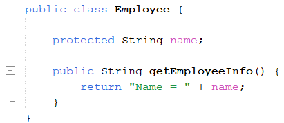

### Class Payable

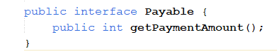

### Class InternshipEmployee

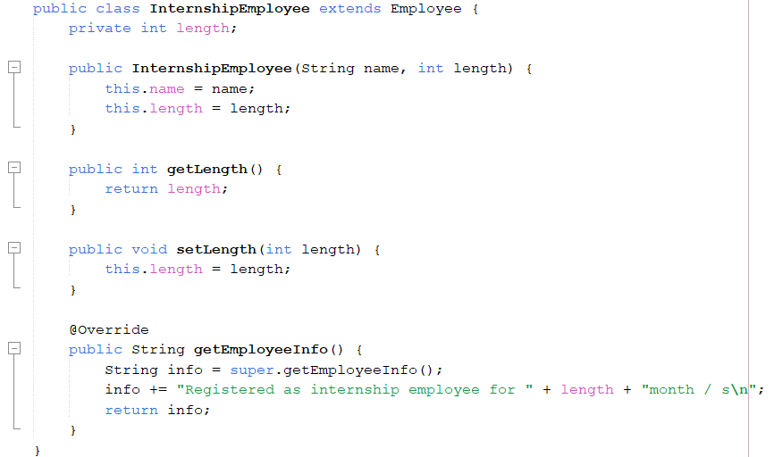

### Class PermanentEmployee

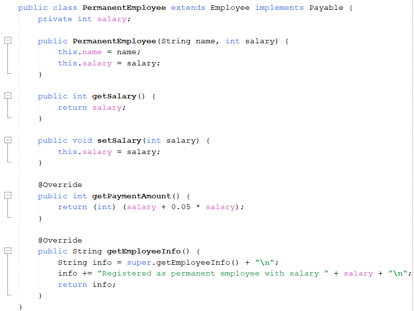

### Class ElectricityBill

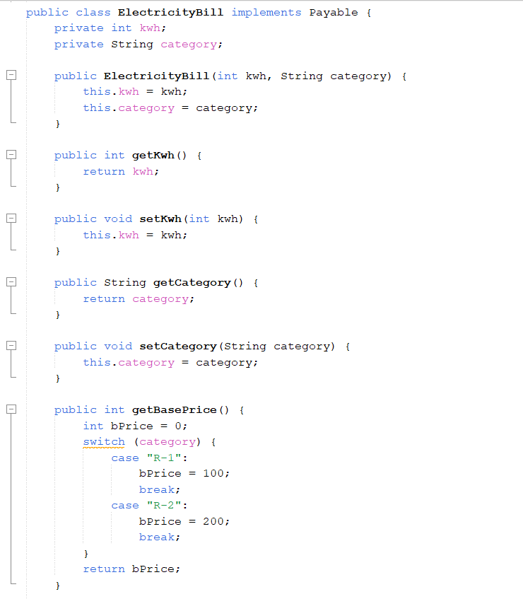
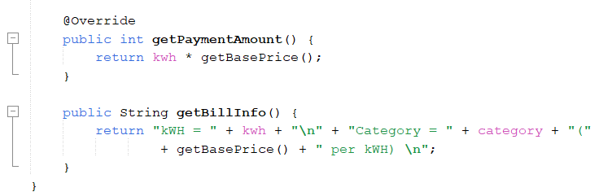

### Class Tester 1

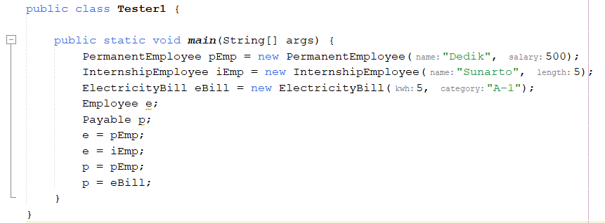

## Pertanyaan

1. Class apa sajakah yang merupakan turunan dari class Employee?

   ### Jawab:

   Class InternshipEmployee dan Class PermanentEmployee

2. Class apa sajakah yang implements ke interface Payable?

   ### Jawab:

   Class PermanentEmployee dan Class ElectricityBill

3. Perhatikan class Tester1, baris ke-10 dan 11. Mengapa e, bisa diisi dengan objek pEmp (merupakan objek dari class PermanentEmployee) dan objek iEmp (merupakan objek dari class InternshipEmploye) ?

   ### Jawab:

   Karena objek pEmp dan objek iEmp merupakan objek subclass dari class Employee, yang dimana class Employee merupakan parent class dari class yang memiliki dua object tersebut.

4. Perhatikan class Tester1, baris ke-12 dan 13. Mengapa p, bisa diisi denganobjekpEmp (merupakan objek dari class PermanentEmployee) dan objek eBill (merupakan objek dari class ElectricityBill) ?

   ### Jawab:

   Karena object pEmp dan object eBill merupakan objek dari suatu class yang mengimplementasikan kelas interface (class IPayable) .

5. Coba tambahkan sintaks: p = iEmp; e = eBill; pada baris 14 dan 15 (baris terakhir dalam method main) ! Apa yang menyebabkan error?

   ### Jawab:

   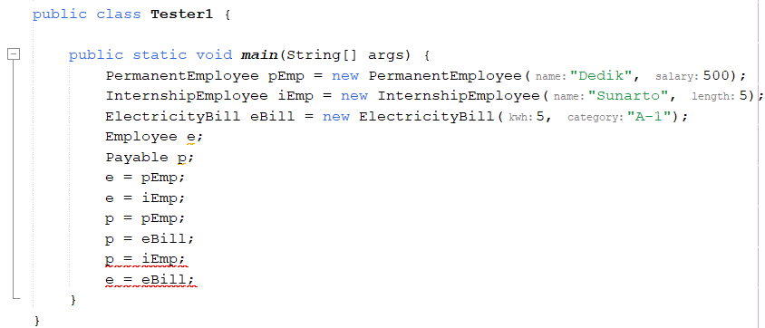
   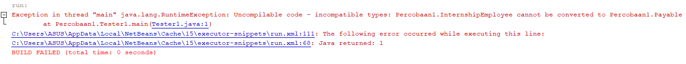

   Akan terjadi error karena, pada code “ p = iEmp ” -> class dari object iEmp ( class InternshipEmployee ) tidak mengimplementasikan class interface. Yang dimana ‘p’ merupakan object dari class interface ( class IPayable ). Sedangkan pada code “ e = eBill “ -> class dari object eBill ( class ElectricityBill ) bukan subclass dari object ‘e’ ( class Employee ).

6. Ambil kesimpulan tentang konsep/bentuk dasar polimorfisme!

   ### Jawab:

   Polimorfisme adalah kemampuan untuk mempunyai beberapa bentuk class yang berbeda, asalkan setiap class memiliki suatu hubungan baik pewarisan maupun interface.

## Percobaan 2

### Class Tester2

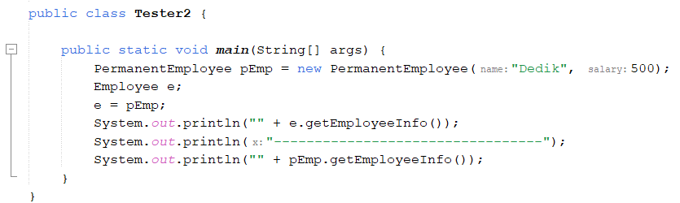

### Output

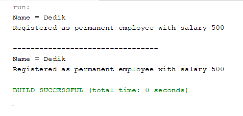

## Pertanyaan

1. Perhatikan class Tester2 di atas, mengapa pemanggilan e.getEmployeeInfo() pada baris 8 dan pEmp.getEmployeeInfo() pada baris 10 menghasilkan hasil sama?

   ### Jawab:

   Karena ‘e’ adalah referensi dari tipe Employee yang merupakan superclass dari PermanentEmployee.

2. Mengapa pemanggilan method e.getEmployeeInfo() disebut sebagai pemanggilan method virtual (virtual method invication), sedangkan pEmp.getEmployeeInfo() tidak?

   ### Jawab:

   Karena ‘e’ merupakan variabel bertipe Employee yang merujuk pada object ‘pEmp’ yang merupakan instance dari class PermanentEmployee.

3. Jadi apakah yang dimaksud dari virtual method invocation? Mengapa
   disebut virtual?

   ### Jawab:

   Virtual Method Inovation mterjadi ketika ada pemanggilan overriding method dari suatu objek polimorfisme. Disebut virtual karena antara method yang dikenal oleh compiler dan method yang dijalankan oleh JVM berbeda.

## Percobaan 3

### Class Tester3

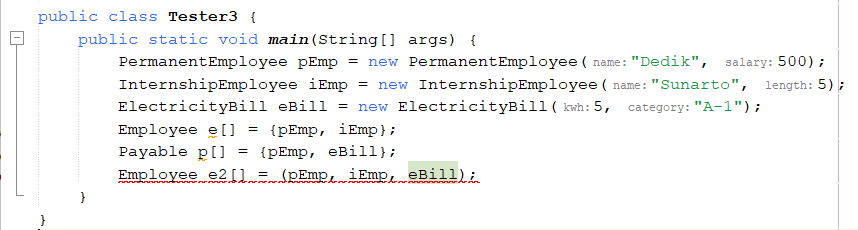

## Pertanyaan

1. Perhatikan array e pada baris ke-8, mengapa ia bisa diisi dengan objekobjek dengan tipe yang berbeda, yaitu objek pEmp (objek dari PermanentEmployee) dan objek iEmp (objek dari InternshipEmployee) ?

   ### Jawab:

   Karena kedua object tesebut merupakan object dari subclass Employee alhasil mesikpun setiap object memiliki tipe data yang berbeda, object akan dicasting menjadi tipe data Employee

2. Perhatikan juga baris ke-9, mengapa array p juga biisi dengan objek-objek dengan tipe yang berbeda, yaitu objek pEmp (objek dari PermanentEmployee) dan objek eBill (objek dari ElectricityBilling) ?

   ### Jawab:

   Karena kedua object tesebut merupakan object dari class yang mengimplementasikan class interface, alhasil mesikpun setiap object memiliki tipe data yang berbeda, object akan dicasting menjadi tipe data Payable.

3. Perhatikan baris ke-10, mengapa terjadi error?

   ### Jawab:

   Karena pada object “eBill” dari class ElectticityBill bukan dari subclass Employee, hal ini yang menyebabkan terjadinya erorr.

## Percobaan 4

### Class Owner

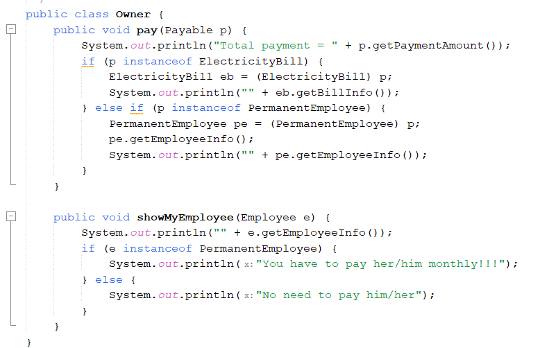

### Class Tester4

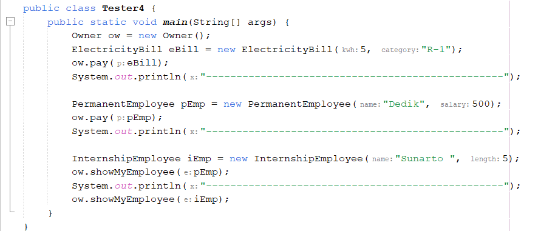

### Output

## Pertanyaan

1. Perhatikan class Tester4 baris ke-7 dan baris ke-11, mengapa pemanggilan ow.pay(eBill) dan ow.pay(pEmp) bisa dilakukan, padahal jika diperhatikan method pay() yang ada di dalam class Owner memiliki argument/parameter bertipe Payable? Jika diperhatikan lebih detil eBill merupakan objek dari ElectricityBill dan pEmp merupakan objek dari PermanentEmployee?

   ### Jawab:

   Alasan object tersebut dapat digunakan pada method pay() karena object tersebut merupakan milik dari suatu class yang mengimplementasikan class interface. Pada method pay() terdapat parameter yang menerima data berupa object yang bertipe data ‘Payable’, berhubung object ‘eBill’ dan ‘pEmp’ merupakan object dari class yang mengimplementasikan class interface, maka object tersebut dapat digunakan sebagai paramateter dari metod pay().

2. Jadi apakah tujuan membuat argument bertipe Payable pada method pay() yang ada di dalam class Owner?

   ### Jawab:

   Untuk menerima data berupa object yang memiliki tipe data IPayable atau suatu object yang classnya mengimplementasikan class Payable.

3. Coba pada baris terakhir method main() yang ada di dalam class Tester4 ditambahkan perintah ow.pay(iEmp); Mengapa terjadi error?

   ### Jawab:

   Karena class InternshipEmployee (pemiik object ‘iEmp’) tidak mengimplementasikan class dari Payable. Sedangkan method pay() hanya menerima argumen untuk object yang masih memiliki warisan dengan class Payable.

4. Perhatikan class Owner, diperlukan untuk apakah sintaks p instanceof ElectricityBill pada baris ke-6 ?

   ### Jawab:

   Digunakan untuk mengetahui apakah ‘p’ merupakan object asal dari class ElectricityBill.

5. Perhatikan kembali class Owner baris ke-7, untuk apakah casting objek disana (ElectricityBill eb = (ElectricityBill) p) diperlukan ? Mengapa objek p yang bertipe Payable harus di-casting ke dalam objek eb yang bertipe ElectricityBill ?

   ### Jawab:

   Agar method dari class ElectricityBill dapat digunakan. Apabila tidak dilakukan casting maka method getBillInfo() tidak akan diketahui karena object tersebut masih bertipe data Payable, sedangkan pada class IPayable tidak terdapat method getBillInfo()

## Tugas

### Class Detroyable

### Class Zombie

### Class WalkingZombie

### Class JumpingZombie

### Class Barrier

### Class Plant

### Class Tester

### Class Hasilnya

