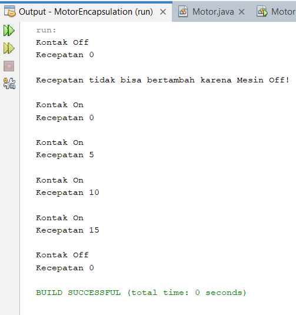
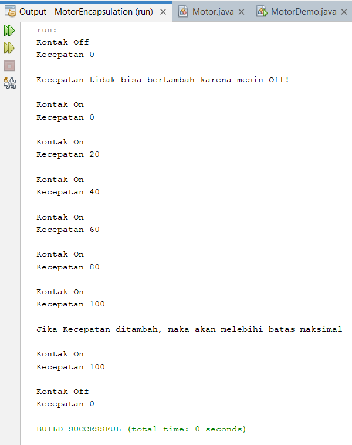
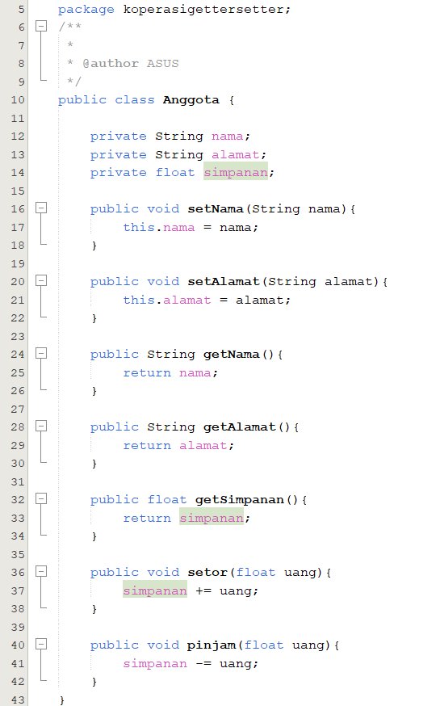
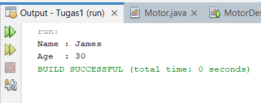
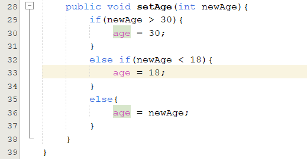

# Laporan Praktikum 3

NIM : 2241720227 \
NAMA : MUHAMMAD IRSYAD DANY \
KELAS : TI - 2C

### 3. Percobaan

## 3.1 Percobaan 1 - Enkapsulasi

### Class Motor

### Class MotorDemo

### Output

## 3.2 Percobaan 2 - Access Modifier

### Class Motor

### Class MotorDemo

### Output

## 3.3 Pertanyaan

1. Pada class TestMobil, saat kita menambah kecepatan untuk pertama kalinya, mengapa muncul peringatan “Kecepatan tidak bisa bertambah karena Mesin Off?"
   > Karena pada saat itu mesin masih pada keadaan OFF sehingga tidak dapat menambah kecepatan. Karena syarat dari bertambahnya kecepatan adalah mesin harus menyala terlebih dahulu.
2. Mengapa atribut kecepatan dan kontakOn diset private?
   > Supaya kontakOn hanya dapat dimodifikasi di dalam class Motor
3. Ubah class Motor sehingga kecepatan maksimalnya adalah 100!

### Modifikasi Class Motor

### Modifikasi Class MotorDemo

### Output setelah di Modifikasi

## 3.4 Percobaan 3 - Getter dan Setter

### Class Anggota

### Class KoperasiDemo

### Output

## 3.5 Percobaan 4 - Konstruktor, Instansiasi

### Mengubah Class Anggota dengan membuat Konstruktor

### Mengubah Class KoperasiDemo dengan melakukan Instansiasi

### Output

## 3.6 Pertanyaan – Percobaan 3 dan 4

1. Apa yang dimaksud getter dan setter?
   > Getter digunakan untuk mendapatkan atau mengambil nilai dari sebuah atribut. Sedangkan Setter digunakan untuk memberikan nilai pada sebuah atribut
2. Apa kegunaan dari method getSimpanan()?
   > Method tersebut digunakan untuk mengambil nilai simpanan yang dimiliki oleh anggota. Method tersebut akan mengembalikan nilai atribut simpanan.
3. Method apa yang digunakan untk menambah saldo?
   > Method setor digunakan untuk menambah saldo anggota
4. Apa yand dimaksud konstruktor?
   > Konstruktor digunakan ketika membuat sebuah objek. Sebuah objek akan diinisialisasi sekaligus saat dibuat jika menggunakan kunstruktor.
5. Sebutkan aturan dalam membuat konstruktor?
   > - Nama konstruktor harus sama dengan nama class
   > - Konstruktor tidak mengembalikan sebuah nilai, tidak memiliki return
   > - Konstruktor tidak memiliki tipe data
   > - Modifier harus public
6. Apakah boleh konstruktor bertipe private?
   > Konstruktor tidak boleh bertipe private. Hal ini dikarenakan konstruktor digunakan pada class lain di beberapa situasi.
7. Kapan menggunakan parameter dengan passsing parameter?
   > Passing parameter dilakukan ketika atribut membutuhkan nilai yang spesifik.
8. Apa perbedaan atribut class dan instansiasi atribut?
   > Pada class terdapat deklarasi sebuah atribut yang masih merupakan blue print karena belum terisi oleh nilai. Sedangkan Instansiasi atribut digunakan ketika memasukkan sebuah nilai pada atribut yang berada di dalam class.
9. Apa perbedaan class method dan instansiasi method?
   > Class method dideklarasikan pada sebuah class. Sedangkan instasiasi method dilakukan ketika pemanggilan method.

## 4. Kesimpulan

Dari percobaan diatas, telah dipelajari kosep dari enkapsulasi, kontruktor, access modifier yang terdiri dari 4 jenis yaitu public, protected, default dan private. Konsep atribut atau method class yang ada di dalam blok code class dan konsep instansiasi atribut atau method. Cara penggunaan getter dan setter beserta fungsi dari getter dan setter. Dan juga telah dipelajari atau memahami notasi UML

## 5. Tugas

1. Cobalah program dibawah ini dan tuliskan hasil outputnya

### Class EncapDemo

### Class EncapTest

### Output

2. Pada program diatas, pada class EncapTest kita mengeset age dengan nilai 35, namun pada saat ditampilkan ke layar nilainya 30, jelaskan mengapa.

   > Karena pada method setAge terdapat pemilihan dengan kondisi jika nilai umur yang dimasukkan lebih dari 30 maka umur akan dirubah menjadi 30, sehingga nilai yang muncul di layar adalah 30.

3. Ubah program diatas agar atribut age dapat diberi nilai maksimal 30 dan minimal 18.

### Modifikasi Kode Program Class EncapDemo

### Modifikasi Kode Program Class EncapTest

### Output setelah di Modifikasi

4. Pada sebuah sistem informasi koperasi simpan pinjam, terdapat class Anggota yang memiliki atribut antara lain nomor KTP, nama, limit peminjaman, dan jumlah pinjaman. Anggota
   dapat meminjam uang dengan batas limit peminjaman yang ditentukan. Anggota juga dapat mengangsur pinjaman. Ketika Anggota tersebut mengangsur pinjaman, maka jumlah pinjaman akan berkurang sesuai dengan nominal yang diangsur. Buatlah class Anggota tersebut, berikan atribut, method dan konstruktor sesuai dengan kebutuhan. Uji dengan TestKoperasi berikut ini untuk memeriksa apakah class Anggota yang anda buat telah sesuai dengan yang diharapkan.

### Kode Program Class Anggota

### Kode Program Class TestKoperasi

### Output yang diinginkan

5. Modifikasi soal no. 4 agar nominal yang dapat diangsur minimal adalah 10% dari jumlah pinjaman saat ini. Jika mengangsur kurang dari itu, maka muncul peringatan “Maaf, angsuran harus 10% dari jumlah pinjaman”.

### Modifikasi Class Anggota

### Modifikasi Class TestKoperasi

### Output

6. Modifikasi class TestKoperasi, agar jumlah pinjaman dan angsuran dapat menerima input dari console.

### Modifikasi Kode Program Class KoperasiTest

### Output setelah di Modifikasi

