# Laporan Praktikum 4

NIM : 2241720227 \
NAMA : MUHAMMAD IRSYAD DANY \
KELAS : TI - 2C

### 4. Praktikum

## 4.1 Percobaan 1

### Processor

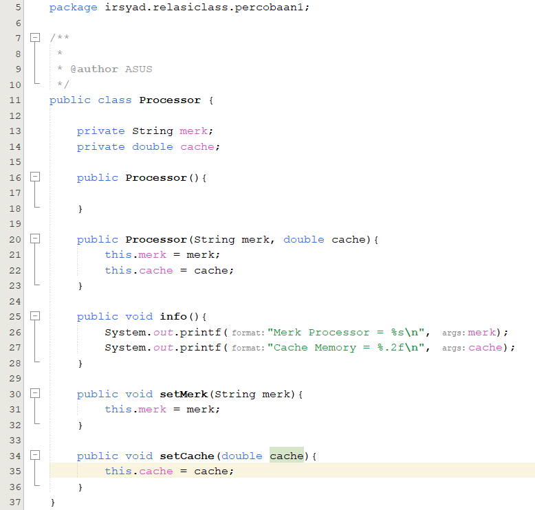

### Laptop

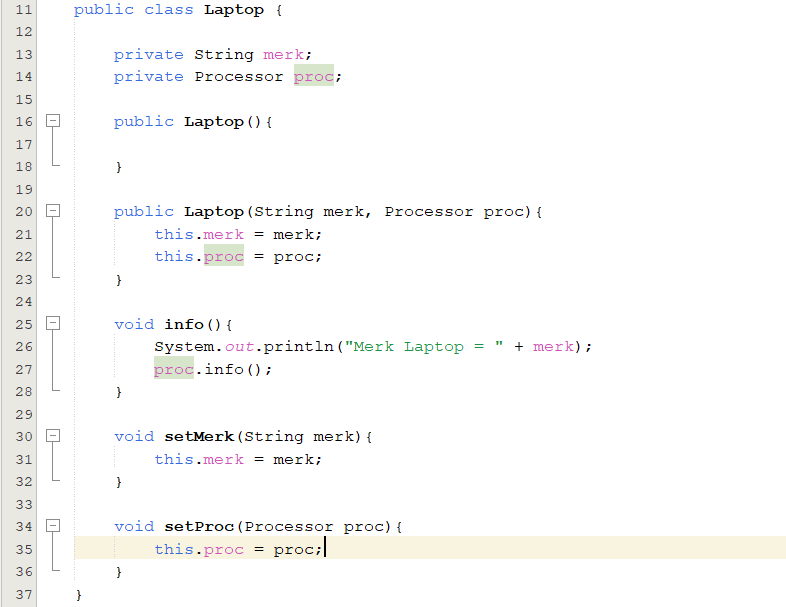

### Main Percobaan1

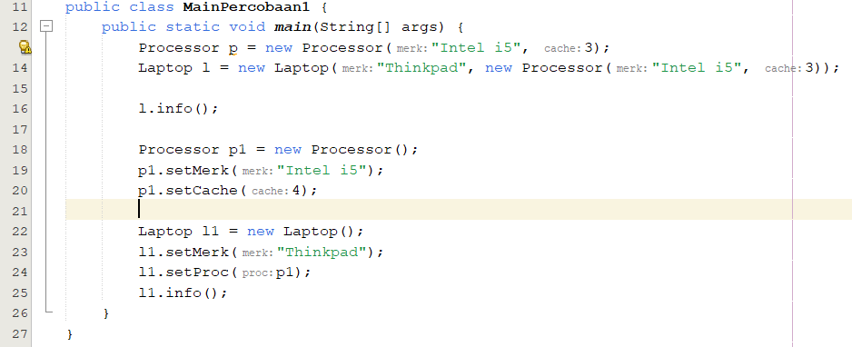

### Output

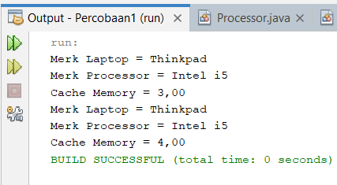

## Pertanyaan!

1. Di dalam class Processor dan class Laptop , terdapat method setter dan getter untuk masing‑masing atributnya. Apakah gunanya method setter dan getter tersebut ?
   > - Kedua method tersebut memiliki fungsi yang berbeda.
   > - Pada method setter digunakan untuk mengatur atribut dari sebuah taribut, sedangkan method getter digunakan untuk mengambil nilai dari sebuah atribut.
2. Di dalam class Processor dan class Laptop, masing‑masing terdapat konstruktor default dan konstruktor berparameter. Bagaimanakah beda penggunaan dari kedua jenis konstruktor tersebut ?
   > Konstruktor default digunakan jika dalam kode program tidak diset sebuah konstruktor berparameter. Sedangkan konstruktor berparameter digunakan untuk menginisialisasi beberapa atribut sekaligus ketika memebuat object.
3. Perhatikan class Laptop, di antara 2 atribut yang dimiliki (merk dan proc), atribut manakah yang bertipe object ?
   > Atribut proc bertipe object.
4. Perhatikan class Laptop, pada baris manakah yang menunjukan bahwa class Laptop memiliki relasi dengan class Processor ?
   > Pada baris di bawah terdapat relasi dengan class Prcessor karena pada class Laptop mendeklarasikan atribut proc dengan tipe object.\
   > 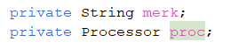
5. Perhatikan pada class Laptop , Apakah guna dari sintaks proc.info() ?
   > Sintaks di atas digunakan untuk memanggil method info() dalam class
   > Processor.
6. Pada class MainPercobaan1, terdapat baris kode:
   Laptop l = new Laptop("Thinkpad", p);.
   Apakah p tersebut ?
   Dan apakah yang terjadi jika baris kode tersebut diubah menjadi:
   Laptop l = new Laptop("Thinkpad", new Processor("Intel i5",
   3));
   Bagaimanakah hasil program saat dijalankan, apakah ada perubahan ?
   > - P adalah nama object dari Processor yang sudah dideklarasikan di main class.
   > - Jika baris diubah seperti kode program di atas maka program akan tetap bisa berjalan sesuai dengan kode program awal.

## 4.2 Percobaan 2

### Mobil

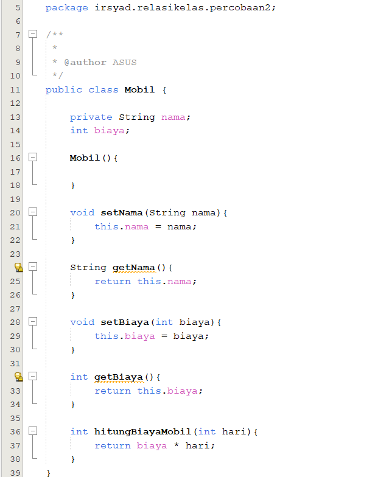

### Sopir

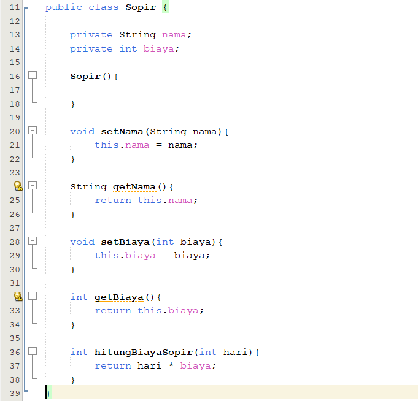

### Pelanggan

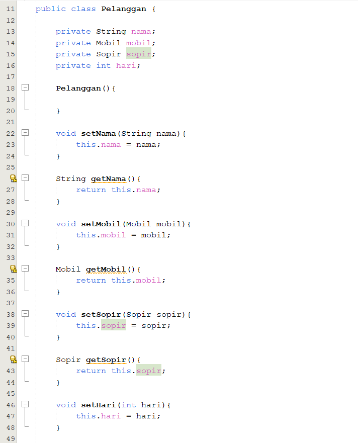
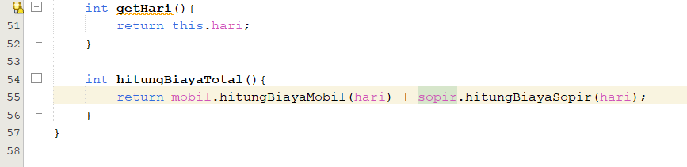

### MainPercobaan2

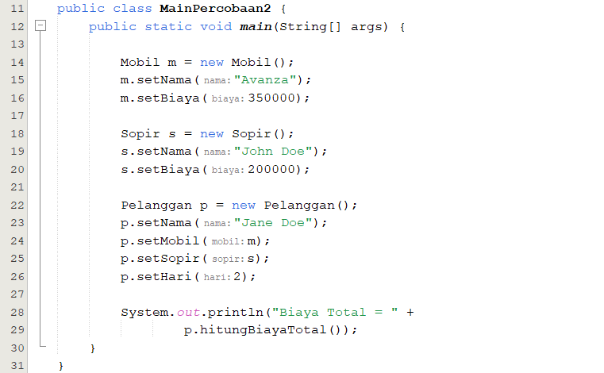

### Output

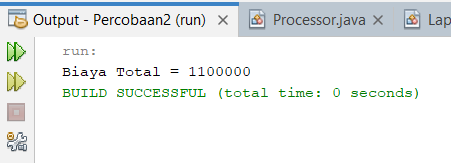

## Pertanyaan!

1. Perhatikan class Pelanggan. Pada baris program manakah yang menunjukan bahwa class Pelanggan memiliki relasi dengan class Mobil dan class Sopir ?
   > Pada baris program berikut ini merupakan relasi antara pelanggan terhadap mobil dan sopir.
   > 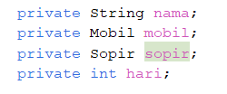
2. Perhatikan method hitungBiayaSopir pada class Sopir, serta method hitungBiayaMobil pada class Mobil. Mengapa menurut Anda method tersebut harus memiliki argument hari ?
   > Method tersebut membutuhkan atribut hari unruk mendapatkan total biaya sopir dan mobil yang disewa dengan cara mengalikan atribut biaya dengan hari.
3. Perhatikan kode dari class Pelanggan. Untuk apakah perintah mobil.hitungBiayaMobil(hari) dan sopir.hitungBiayaSopir(hari) ?
   > Kedua sintaks di atas digunakan untuk memanggil method dalam dua object yaitu mobil dan sopir dan menghitung biayanya.
4. Perhatikan class MainPercobaan2. Untuk apakah sintaks p.setMobil(m) dan p.setSopir(s) ?
   > Digunakan untuk mengatur atribut mobil dan atribut supir dalam class pelanggan.
5. Perhatikan class MainPercobaan2. Untuk apakah proses p hitungBiayaTotal() tersebut ?
   > Untuk menghitung tital biaya sewa dari sopir dan mobil sehingga hasil kedua method di atas ditambahkan.
6. Perhatikan class MainPercobaan2, coba tambahkan pada baris terakhir dari method main dan amati perubahan saat di‑run!

System.out.println(p.getMobil().getMerk());

Jadi untuk apakah sintaks p.getMobil().getMerk() yang ada di dalam method main tersebut?

> - Hasil Run Setelah Penambahan Kode Program
>   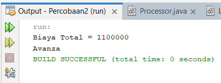
> - Penggunaan sintaks di atas digunakan untuk menampilkan nama mobil dari mobil yang disewa oleh pelanggan.

## 4.3 Percobaan 3

### Pegawai

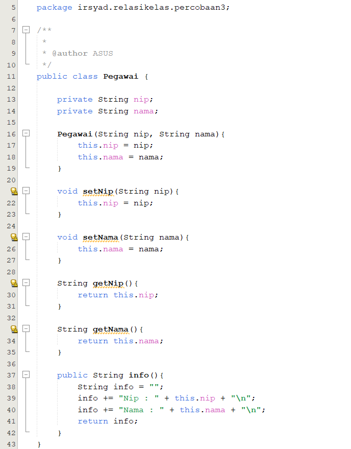

### Kereta Api

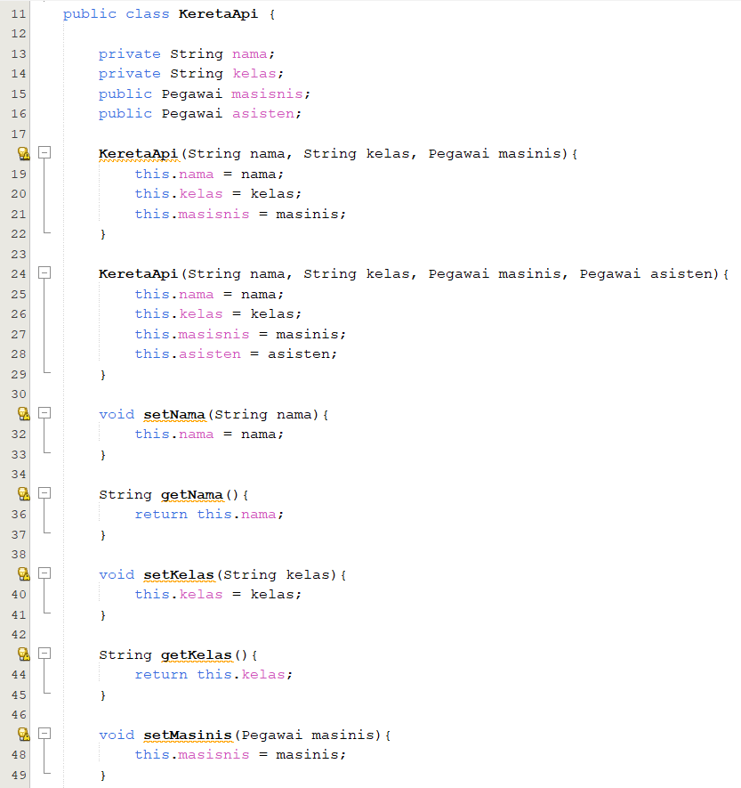
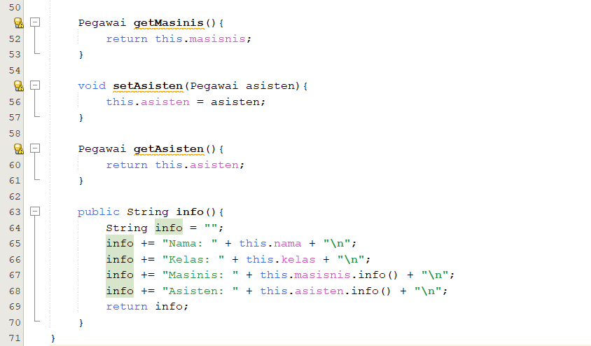

### MainPercobaan3

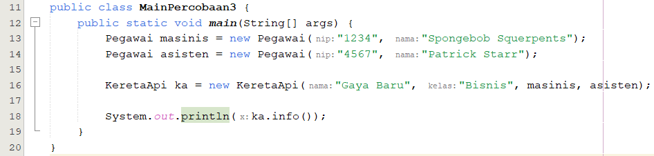

### Output

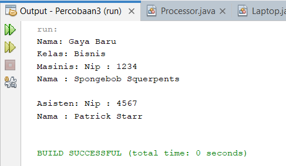

## Pertanyaan!

1. Di dalam method info() pada class KeretaApi, baris this.masinis.info() dan this.asisten.info() digunakan untuk apa ?
   > Dua method di atas digunakan untuk mencetak info masing-masing objek yaitu info masinis dan info asisten.
2. Buatlah main program baru dengan nama class MainPertanyaan pada package yang sama. Tambahkan kode berikut pada method main() !

Pegawai masinis = new Pegawai("1234", "Spongebob
Squarepants");
KeretaApi keretaApi = new KeretaApi("Gaya Baru", "Bisnis", masinis);

System.out.println(keretaApi.info());

> 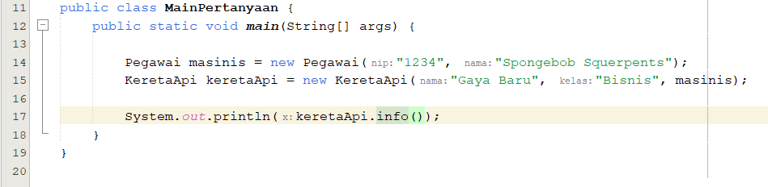

3. Apa hasil output dari main program tersebut ? Mengapa hal tersebut dapat terjadi ?

   > 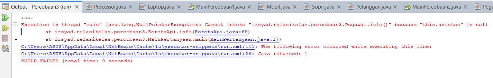
   > Program mengalami error. Karena nilai atribut dari asisten kosong dan program menjalankan print info asisten.

4. Perbaiki class KeretaApi sehingga program dapat berjalan !
   > - Perbaikan Class Kereta Api pada method info()
   >   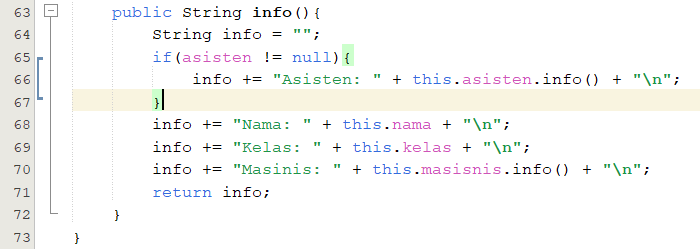
   > - Hasil Run Program
   >   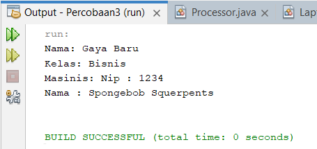

## 4.4 Percobaan 4

### Penumpang

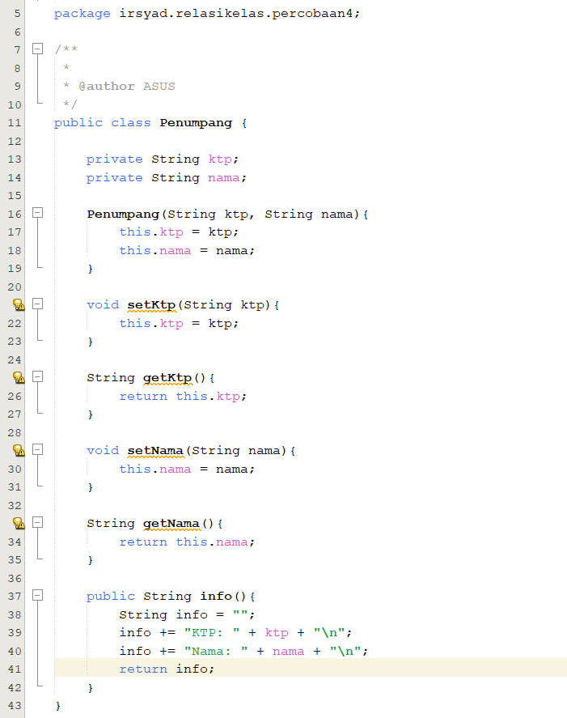

### Kursi

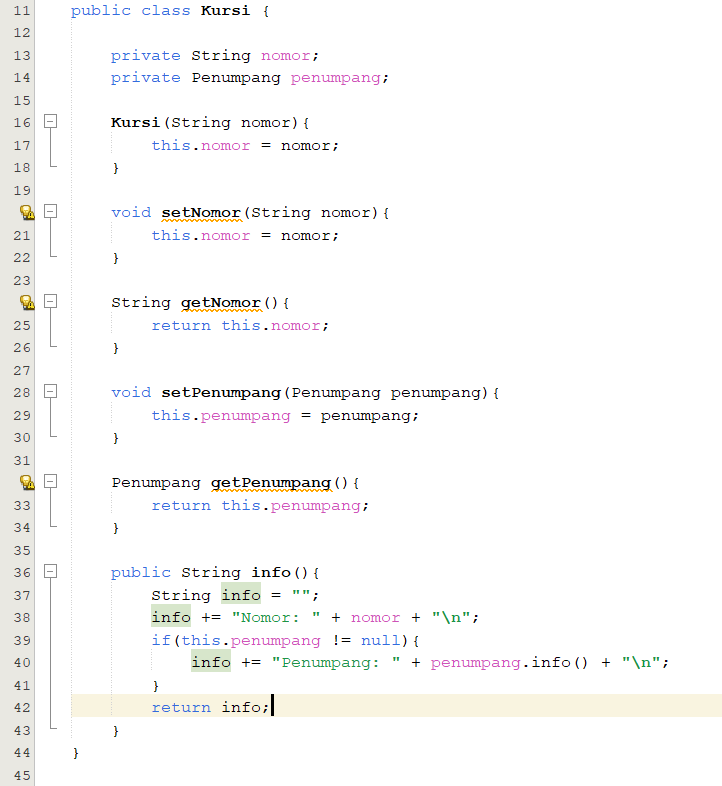

### Gerbong

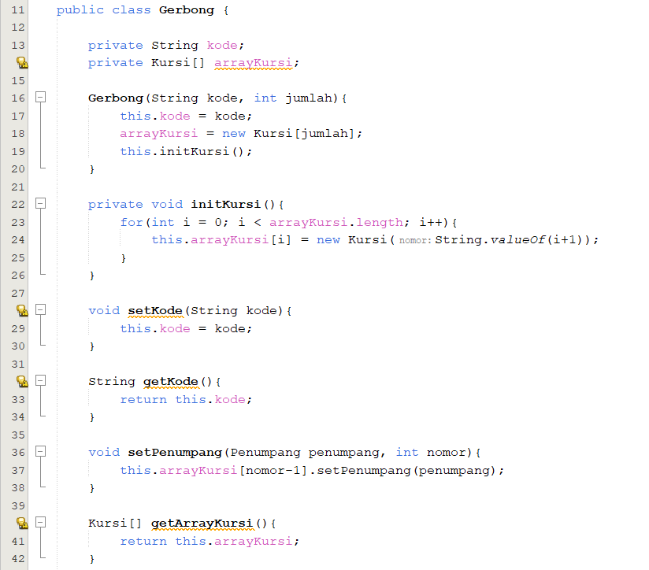
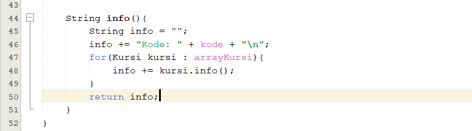

### MainPercobaan4

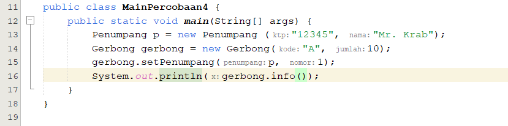

### Output

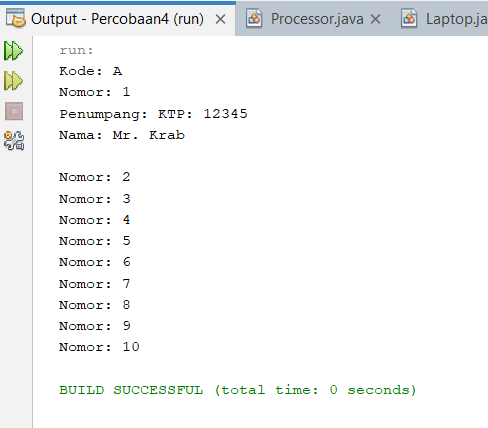

## Pertanyaan!

1. Pada main program dalam class MainPercobaan4, berapakah jumlah kursi dalam
   Gerbong A ?
   > Terdapat sejumlah 10 kursi pada gerbong A
2. Perhatikan potongan kode pada method info() dalam class Kursi. Apa maksud kode tersebut ?
   > Program melakukan pemilihan dengan syarat jika penumpang tidak kosong maka program akan mengeprint info penumpang. Jika penumpang kosong maka pemilihan tidak akan di run.
3. Mengapa pada method setPenumpang() dalam class Gerbong, nilai nomor dikurangi dengan angka 1 ?
   > Supaya mengisi array sesuai dengan indeks array. Jika nomor tidak dikurangi satu maka array tidak diisi berdasarkan indeks.
4. Instansiasi objek baru budi dengan tipe Penumpang, kemudian masukkan objek baru tersebut pada gerbong dengan gerbong.setPenumpang(budi, 1). Apakah yang terjadi ?

> Budi Menempati tempat duduk Mr. Crab
> 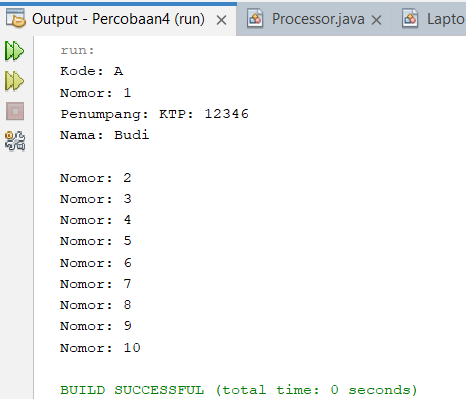

5. Modifikasi program sehingga tidak diperkenankan untuk menduduki kursi yang sudah ada penumpang lain !
   > 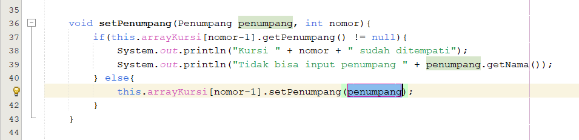

## Tugas

- Berdasarkan latihan di pertemuan teori, rancang dengan class diagram, kemudian implementasikan ke dalam program! Studi kasus harus mewakili relasi class dari percobaan‑percobaan yang telah dilakukan pada materi ini, setidaknya melibatkan minimal 4 class (class yang berisi main tidak dihitung).

### Class Diagram Perpustakaan

> Saya akan menggunakan studi kasus "Perpustakaan" dengan class Perpustakaan, Buku, Member, dan Transaksi.

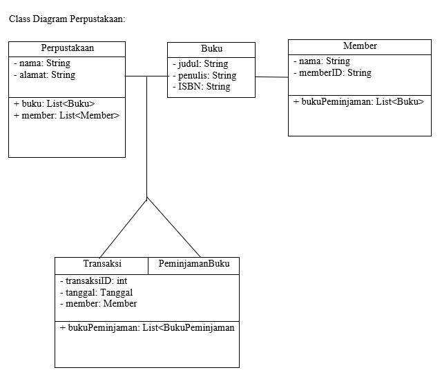

> Penjelasan class-class di atas:
>
> - Perpustakaan: Class ini merepresentasikan sebuah perpustakaan. Memiliki atribut seperti nama, alamat, dan daftar buku yang tersedia di perpustakaan. Selain itu, terdapat daftar anggota perpustakaan yang merupakan objek dari class Member.
> - Buku: Class ini merepresentasikan sebuah buku dalam perpustakaan. Memiliki atribut seperti judul, penulis, ISBN, dan daftar transaksi yang terkait dengan buku ini.
> - Member: Class ini merepresentasikan seorang anggota perpustakaan. Memiliki atribut seperti nama dan ID anggota. Selain itu, anggota dapat meminjam beberapa buku yang diwakili oleh booksBorrowed.
> - Transaksi: Class ini merepresentasikan transaksi peminjaman buku oleh seorang anggota perpustakaan. Memiliki atribut seperti ID transaksi, tanggal transaksi, anggota yang melakukan transaksi, dan daftar buku yang dipinjam dalam transaksi ini.
> - Peminjaman Buku: Class ini merepresentasikan buku yang dipinjam dalam satu transaksi. Memiliki hubungan ke class Book dan juga mencatat jumlah hari peminjaman.
