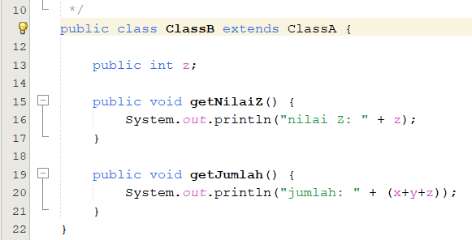

# Laporan Praktikum 6

NIM : 2241720227 \
NAMA : MUHAMMAD IRSYAD DANY \
KELAS : TI - 2C

### 6. Praktikum

## 6.1 Percobaan 1 (extends)

### ClassA

### ClassB

### MainPercobaan1

### Output

## Pertanyaan

1. Pada percobaan 1 diatas program yang dijalankan terjadi error, kemudian perbaiki sehingga program tersebut bisa dijalankan dan tidak error!

   > Perbaikan Kode
   > 
   > Penambahan extends ClassA berarti bahwa ClassB mewarisi sifat dari ClassA sehingga atribut nilai x dan y dapat dipanggil di ClassB Run Program :
   > 

2. Jelaskan apa penyebab program pada percobaan 1 ketika dijalankan terdapat error!
   > Dikarenakan tidak ada extends di dalam ClassB sehingga ClassB tidak mewarisi atribut dari ClassA. Ketika atribut milik ClassA digunakan pada ClassB, maka program akan error. Program tidak mengenali atribut ClassA yang dipanggil pada ClassB karena ClassB tidak mewarisi atribut tersebut.

## 6.2 Percobaan 2 (Hak Akses)

### ClassA

### ClassB

### MainPercobaan2

### Output

## Pertanyaan

1. Pada percobaan 2 diatas program yang dijalankan terjadi error, kemudian perbaiki sehingga program tersebut bisa dijalankan dan tidak error!

   > Penambahan Extends pada ClassB
   > 
   > Perubahan modifier private ke public
   > 
   > Dan Outputnya :
   > 

2. Jelaskan apa penyebab program pada percobaan 1 ketika dijalankan terdapat error!
   > - ClassB tidak memiliki extends dari classA sehingga saat atribut digunakan oleh ClassB, program tidak mengenali atribut tersebut dan berakhir error.
   > - Serta atribut dalam ClassA diberikan modifier private sehingga tidak dapat digunakan di luar class dan menyebabkan error.

## 6.3 Percobaan 3 (super)

### Bangun

### Tabung

### MainPercobaan3

### Output

## Pertanyaan

1. Jelaskan fungsi “super” pada potongan program berikut di class Tabung!

   > Kata kunci super digunakan sebagai rujukan atribut dari class parent. Yang berarti class Tabung pada saat itu menggunakan atribut dari kelas parent yaitu phi dan r.

2. Jelaskan fungsi “super” dan “this” pada potongan program berikut di class Tabung!

   > Class Tabung adalah anak dari Class Bangun sehingga super pada kode program di atas merujuk pada atribut di class parent atau Class Bangun, sedangkan kata kunci this merujuk pada atribut dari Class Tabung itu sendiri.

3. Jelaskan mengapa pada class Tabung tidak dideklarasikan atribut “phi” dan “r” tetapi class tersebut dapat mengakses atribut tersebut!
   > Phi dan r memiliki modifier berupa protected yang dapat diakses selama Class tersebut berada pada package yang sama. Bangun dan Tabung berada di package yang sama dan subclass dari parent tersebut. Berbeda dengan modifier private yang hanya bisa diakses hanya pada Class yang dideklarasikan atribut tersebut.

## 6.4 Percobaan 4 (super constructor)

### ClassA

### ClassB

### ClassC

### MainPercobaan4

### Output

## Pertanyaan

1. Pada percobaan 4 sebutkan mana class yang termasuk superclass dan subclass, kemudian jelaskan alasannya!

   > - Superclass : ClassA, karena tidak ada kata kunci extends
   > - Subclass : ClassB, ClassC, ClassD, karena ada kata kunci extends dari parent yang berbeda-beda.

2. Ubahlah isi konstruktor default ClassC seperti berikut:
   Tambahkan kata super() di baris Pertaman dalam konstruktor defaultnya. Coba jalankan kembali class Percobaan4 dan terlihat tidak ada perbedaan dari hasil outputnya!

> 
> Hasil : tidak ada perubahan dalam kode program berikut.

3. Ublah isi konstruktor default ClassC seperti berikut:
   Ketika mengubah posisi super() dibaris kedua dalam kontruktor defaultnya dan terlihat ada error. Kemudian kembalikan super() kebaris pertama seperti sebelumnya, maka errornya akan hilang.\
   Jelaskan bagaimana urutan proses jalannya konstruktor saat objek test dibuat!

> Konstruktor akan dijalankan urut dari parent teratas terlebih dahulu, sehingga program akan pertama kali menjalankan konstruktor pada ClassA dilanjut ClassB dan terakhir adalah ClassC.

4. Apakah fungsi super() pada potongan program dibawah ini di ClassC!
   > 
   > Kode program di atas digunakan untuk memanggil konstruktor pada class parent.

## TUGAS

1. Buatlah sebuah program dengan konsep pewarisan seperti pada class diagram berikut ini.\
   \
   Kemudian buatlah instansiasi objek untuk menampilkan data nama pegawai dan gaji yang didapatkannya

### Class Pegawai

### Class Dosen

### Class DaftarGaji

### Main Class

### Output

