# Laporan Praktikum 7

NIM : 2241720227 \
NAMA : MUHAMMAD IRSYAD DANY \
KELAS : TI - 2C

### 6. Praktikum

## 6.1 Percobaan 1

### Class Karyawan

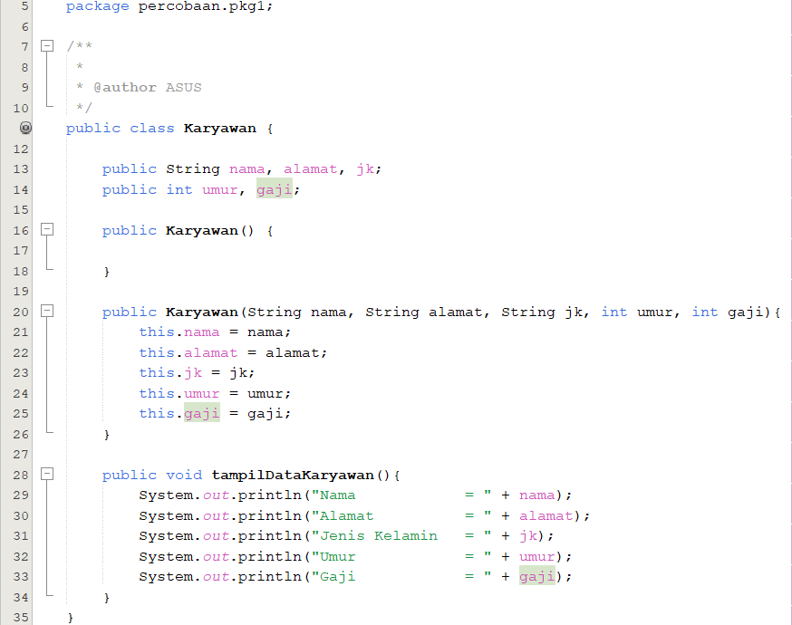

### Class Manager

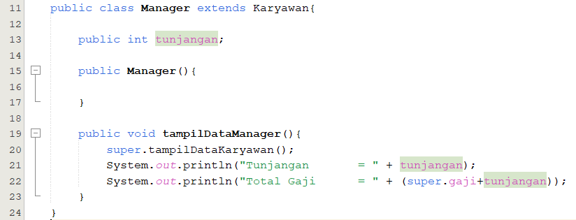

### Class Staff

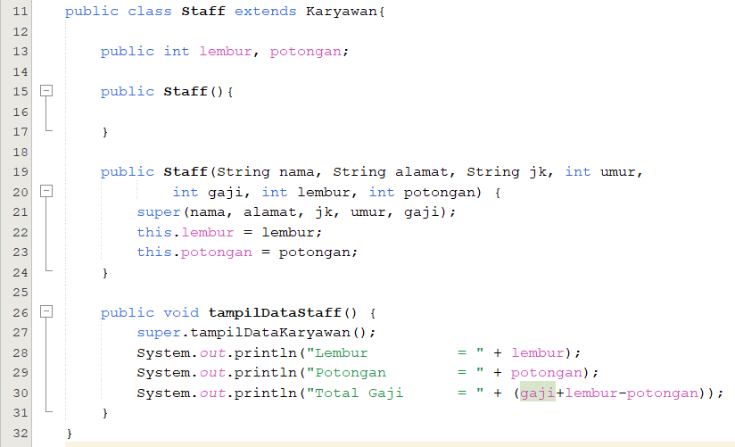

### MainClass Inheritance1

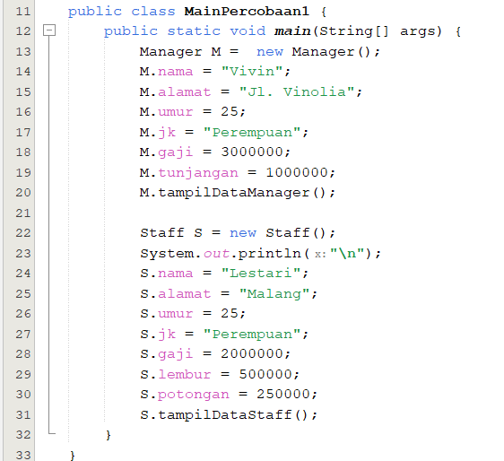

### Output

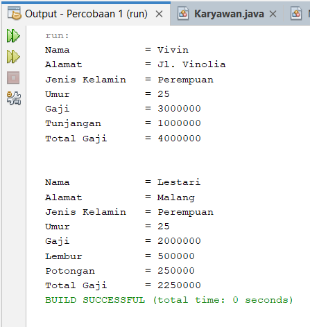

## Pertanyaan

1. Sebutkan class mana yang termasuk super class dan sub class dari percobaan 1 diatas!
   > - Superclass : Karyawan
   > - Subclass : Manager dan Staff
2. Kata kunci apakah yang digunakan untuk menurunkan suatu class ke class yang lain?
   > Extends adalah kata kunci yang digunakan untuk menurunkan suatu class
3. Perhatikan kode program pada class Manager, atribut apa saja yang dimiliki oleh class tersebut? Sebutkan atribut mana saja yang diwarisi dari class Karyawan!
   > - Atribut pada class Manager yaitu : tunjangan, nama, alamat, jk, umur, gaji
   > - Atribut yang diwarisi oleh class Manager dari class Karyawan adalah nama, alamat, jk, umur, gaji
4. Jelaskan kata kunci super pada potongan program dibawah ini yang terdapat pada class Manager!
   > Kata kunci super pada class Manager digunakan untuk memanggil atribut gaji yang berada pada Superclass atau class Karyawan
5. Program pada percobaan 1 diatas termasuk dalam jenis inheritance apa?
   Jelaskan alasannya!
   > Jenis inheritance dalam percobaan 1 adalah Hierarchical Inheritance yang mana satu class memiliki lebih dari satu class turunan.

## 6.2 Percobaan 2

### Class StaffTetap

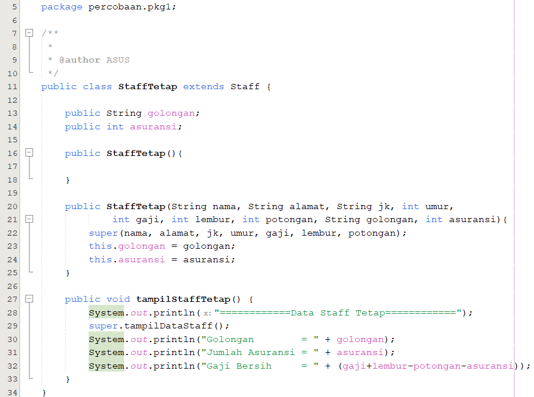

### Class StaffHarian

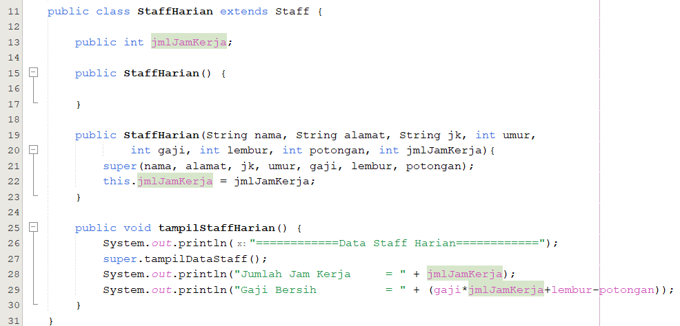

### MainClass

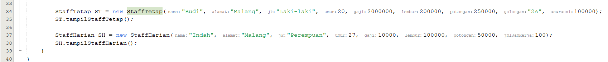

### Output

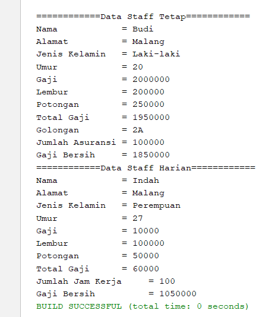

## Pertanyaan

1. Berdasarkan class diatas manakah yang termasuk single inheritance dan mana yang termasuk multilevel inheritance?
   > - Single Inheritance :\
   >   Super Class = Class Karyawan\
   >   Subclass = Class Manager
   > - Multilevel Inheritance :\
   >   Super Class = Class Karyawan\
   >   Subclass parent Karyawan = Class Staff\
   >   Subclass parent Staff = Class StaffTetap dan Class StaffHarian
2. Perhatikan kode program class StaffTetap dan StaffHarian, atribut apa saja yang dimiliki oleh class tersebut? Sebutkan atribut mana saja yang diwarisi dari class Staff!
   > - Atribut yang hanya dimiliki oleh StaffTetap yaitu golongan, asuransi, lembur, potongan
   > - Atribut yang hanya dimiliki oleh StaffHarian yaitu jmlJamKerja
   > - Atribut Warisan = lembur, potongan, nama, alamat, umur, jk, gaji
3. Apakah fungsi potongan program berikut pada class StaffHarian?
   > Kata kunci super digunakan untuk memanggil konstruktor pada super class untuk memasukkan nilai atribut dalam super class.
4. Apakah fungsi potongan program berikut pada class StaffHarian?
   > Fungsi sintaks di atas untuk memanggil method tampilDataStaff dan kata kunci super mengacu pada superclass.
5. Terlihat dipotongan program diatas atribut gaji, lembur dan potongan dapat diakses langsung. Kenapa hal ini bisa terjadi dan bagaimana class StaffTetap memiliki atribut gaji, lembur, dan potongan padahal dalam class tersebut tidak dideklarasikan atribut gaji, lembur, dan potongan?
   > Karena class StaffTetap mewarisi class Staff dan class Staff mewarisi class Karyawan. Sehingga atribut yang berada pada class Karyawan dapat dipanggil di class StaffTetap.

## 6.3 Tugas

### 6.3.1 Tugas1

### Class Komputer

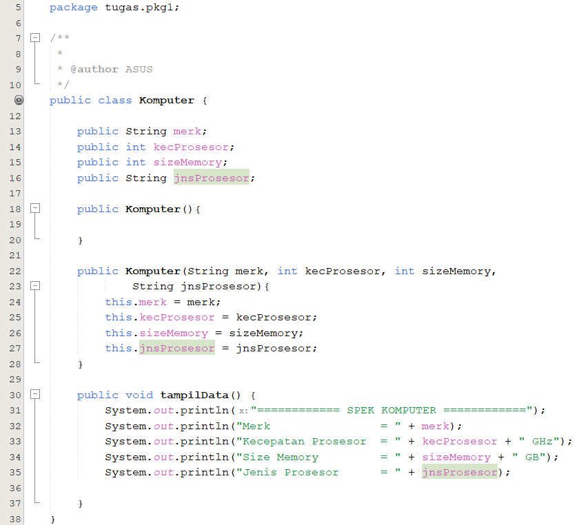

### Class Laptop

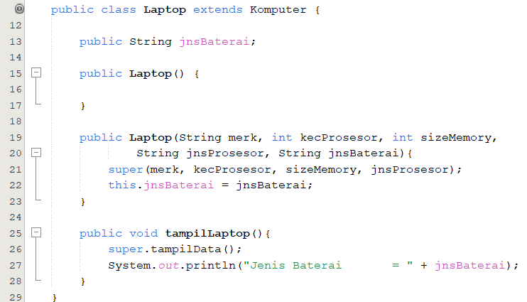

### Class PC

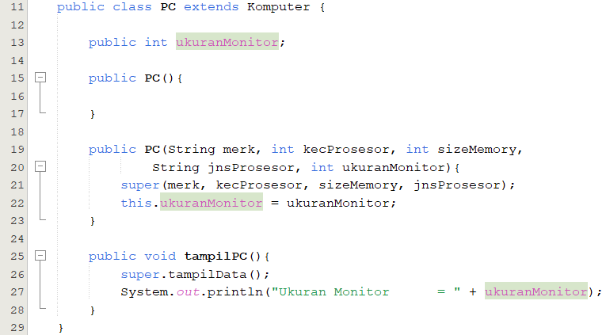

### Class Mac

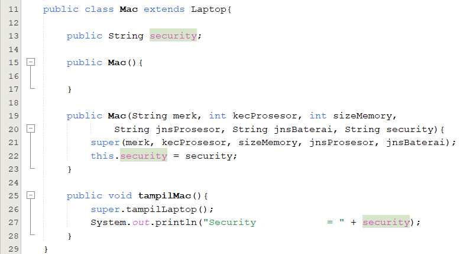

### Class Windows

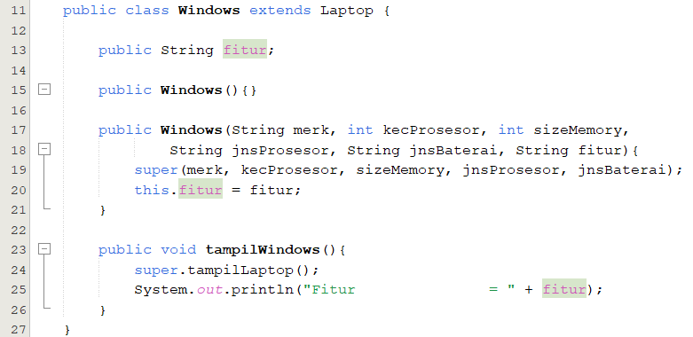

### MainClass Tugas1

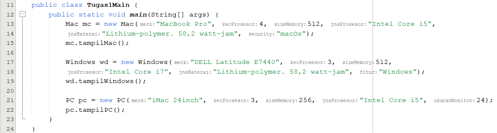

### Output

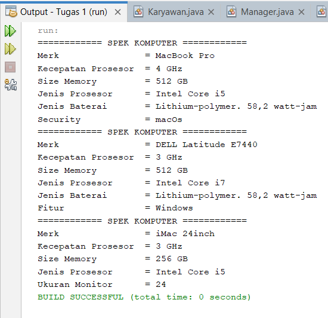

### 6.3.2 Tugas2

### Class Pegawai

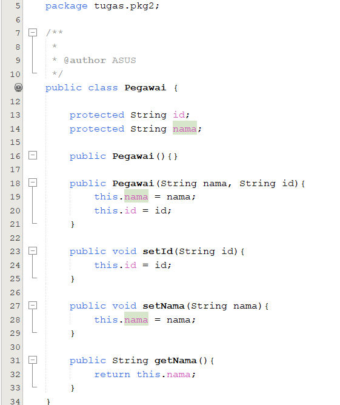

### Class Kasir

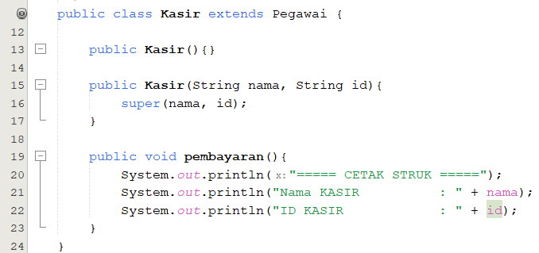

### Class Manager

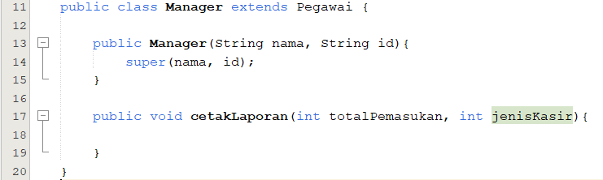

### Class KasirGudang

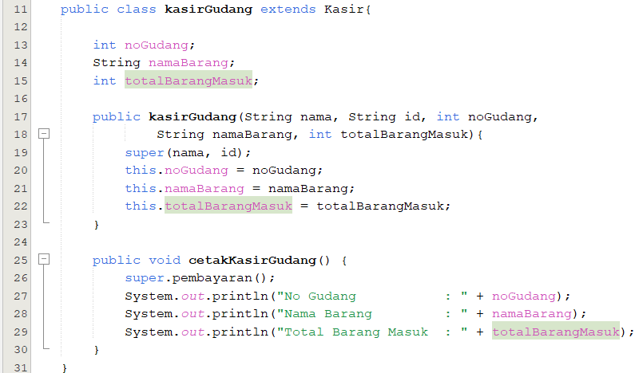

### Class KasirTamu

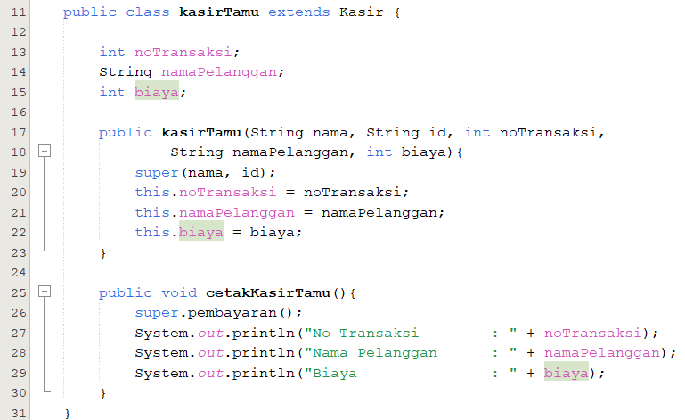

### MainClass Tugas2

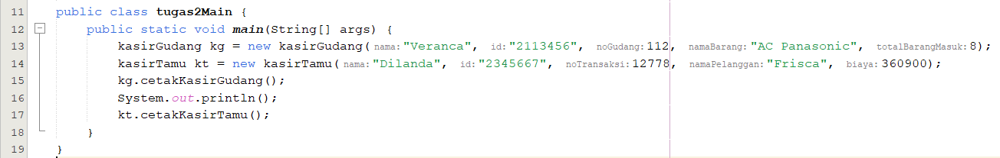

### Output

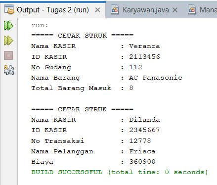
