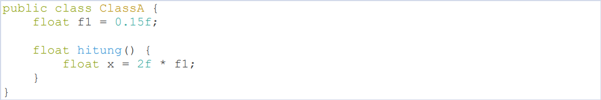
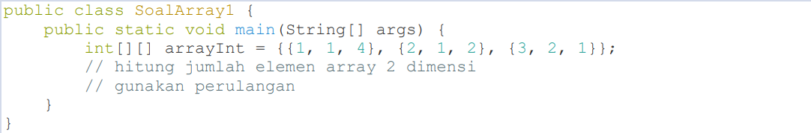
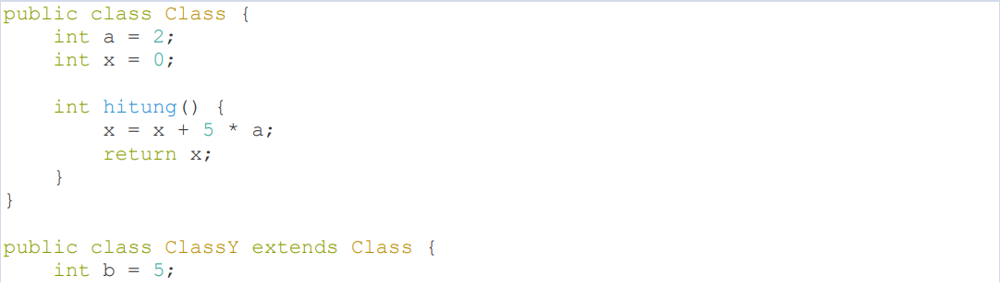

# Laporan Praktikum 8 (UTS OOP)

NIM : 2241720227 \
NAMA : MUHAMMAD IRSYAD DANY \
KELAS : TI - 2C

## Soal 1: Penulisan Class

Berdasarkan contoh class ClassA di bawah ini, jelaskan apakah penulisan source code pada contoh class tersebut sudah benar. Jika tidak, apa yang perlu diperbaiki?

### Jawab:

Penulisan source code pada class tersebut masih belum benar. Kesalahan pada contoh class tersebut ada pada metodh hitung() yang seharusnya menggunakan pernyataan return. Sehingga nilai x akan dikembalikan oleh metodh hitung.

### Kode-Program:

### Class A

### Class A (Main)

### Output

## Soal 2: Perhitungan Jumlah Elemen Array 2 Dimensi

Pada class SoalArray1, terdapat array 2 dimensi dengan ukuran 3x3. Tuliskan code Java untuk menghitung jumlah total elemen array tersebut dengan menggunakan perulangan.

### Jawab:

### Class Array1

### Output

## Soal 3: Pewarisan Atribut dan Method

Pada source code yang diberikan, class ClassY merupakan turunan dari class Class. Sebutkan atribut dan method apa saja yang diwarisi oleh ClassY dari kelas induknya (class Class). Jelaskan juga apa output dari code yang ditulis pada class ClassY dan bagaimana nilai tersebut diperoleh.

### Jawab:

Atribut yang diwarisi adalah a dan x. Method yang diwarisi adalah method hitung(). Outputnya adalah seperti berikut:

Pertama, method hitung() dari Class dipanggil dan terjadi proses atribut x yang bernilai 0 ditambahkan dengan 5 kemudian dikali atribut a yang bernilai 2. Nilai x sekarang menjadi 10.

Kedua, method nilaiY() dari ClassY dipanggil dan terjadi proses mengalikan nilai yang dikembalikan oleh method hitung() pada Class (yaitu 10) dengan atribut b yang bernilai 5. Dan hasilnya adalah 50.

## Soal 4: Class Mahasiswa dengan Constructor

Dalam class Mahasiswa, lengkapi code dengan:

- Menambahkan constructor untuk mengisi atribut nim, nama, alamat, dan jenisKelamin.
- Membuat objek mahasiswa dan mengisi atribut nim, nama, alamat, dan jenisKelamin melalui constructor.

### Jawab:

### Class Mahasiswa

### Class Main

### Output

## Soal 5: OOP Buku -> Penulis

Perhatikan class diagaram berikut dan Buatlah Source code dalam Bahasa java berdasarkan class diagram tersebut

### Jawab:

### Class Penulis

### Class Buku

### ClassMain

### Output

