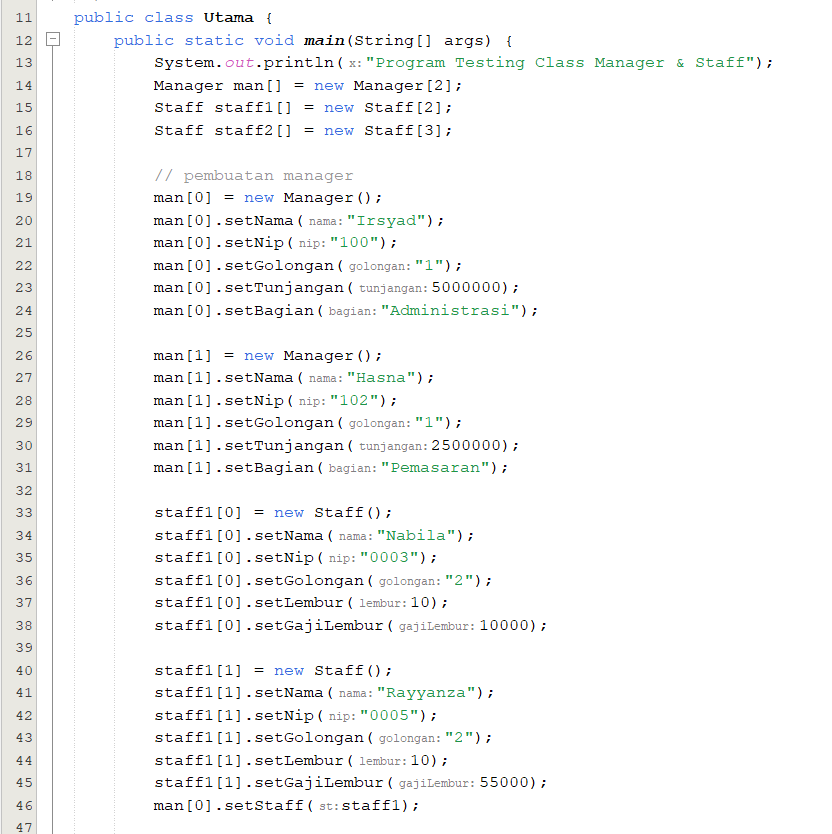

# Laporan Praktikum 9

NIM : 2241720227 \
NAMA : MUHAMMAD IRSYAD DANY \
KELAS : TI - 2C

## Percobaan 1

### Class Karyawan

### Class Staff

### Class Manager

### Class Utama

### Output

## Latihan

1. Dari source coding diatas terletak dimanakah overloading?

   Jawab:

   Overloading terdapat pada method perkalian.

2. Jika terdapat overloading ada berapa jumlah parameter yang berbeda?

   Jawab:

   Terdapat dua method perkalian yang berbeda jumlah parameternya

   - Method pertama memiliki dua parameter yaitu int a dan int b.
   - Method kedua memiliki tiga parameter yaitu int a, int b, dan int c.

3. Dari source coding diatas terletak dimanakah overloading?

   Jawab:

   Overloading terdapat pada method perkalian.

4. Jika terdapat overloading ada berapa tipe parameter yang berbeda?

   Jawab:

   Terdapat dua method perkalian yang berbeda jumlah parameternya

   - Method pertama memiliki dua parameter bertipe int.
   - Method kedua memiliki dua parameter bertipe double.

5. Dari source coding diatas terletak dimanakah overriding?

   Jawab:

   Overriding terjadi pada metode swim dalam kelas Piranha.

6. Jabarkanlah apabila sourcoding diatas jika terdapat overriding?

   Jawab:

   Overriding terjadi ketika kelas anak (Piranha) memiliki method nama, tipe pengembalian, dan parameter yang sama seperti metode di kelas induk (Ikan). Dalam hal ini, metode swim di kelas Piranha menggantikan metode swim di kelas Ikan. Ketika objek b dibuat sebagai objek Piranha, pemanggilan b.swim() akan memanggil metode swim dari kelas Piranha, bukan dari kelas Ikan.

## Tugas Overloading

Implementasikan konsep overloading pada class diagram dibawah ini :

## Jawab:

### Class Segitiga

### Class Main

### Output

## Tugas Overriding

Implementasikan class diagram dibawah ini dengan menggunakan teknik dynamic method dispatch :

## Jawab:

### Class Manusia

### Class Dosen

### Class Mahasiswa

### Main

### Output

